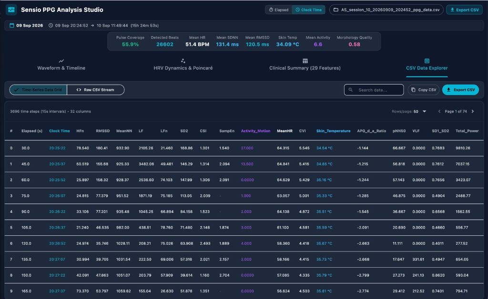
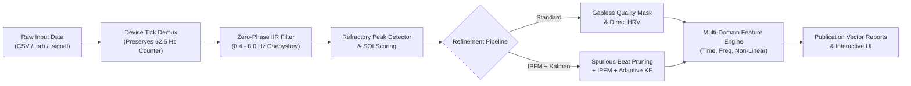

# CCS PPG Studio - Clinical & Research Photoplethysmography (PPG) Analytics Platform

<p align="center">
  
</p>

<p align="center">
  A Joint Research & Engineering Collaboration of<br>
  <b>Centre for Consciousness Studies (CCS)</b>, Department of Neurophysiology,<br>
  <b>National Institute of Mental Health and Neurosciences (NIMHANS)</b>, Bangalore, India<br>
  🤝<br>
  <a href="https://www.sensio-ai.in/"><b>SensIO</b></a> &nbsp;|&nbsp; <a href="https://www.neuro-stellar.com/"><b>Neurostellar</b></a>
</p>

<p align="center">
  
  
  
  
  
</p>

**Version:** 2.1.0  
**Build:** Research & Clinical Edition  

Welcome to **CCS PPG Studio**, a high-performance, cross-platform signal visualization, quality-gated beat detection, and autonomic neurophysiology analysis suite. Built specifically for continuous photoplethysmography (PPG) acquired from wearable sensors (such as the **SensIO Smart Ring**, **Orbit Wearable**, and clinical PPG pulse oximeters), CCS PPG Studio bridges raw sensor telemetry with publication-ready digital biomarkers, multi-domain Heart Rate Variability (HRV), pulse morphology analytics, and executive PDF reporting.

---

## 🌟 Executive Overview & Key Capabilities

CCS PPG Studio addresses the primary engineering and signal quality challenges inherent in ambulatory and wearable PPG: motion artifacts, sensor detachment, baseline wander, non-uniform Bluetooth packet arrival, and ectopic pulses.

* **Gapless Macro-Episode Quality Partitioning**: Every millisecond of the recording is labeled into mutually exclusive, contiguous states (`GOOD`, `REJECT`, `BAD`), guaranteeing complete coverage accounting without artificial interpolation across artifact gaps.
* **Dual-Stage Refractory SQI Peak Detection**: Combines physiological refractory gating ($250\text{ ms} \le RR \le 2000\text{ ms}$, $30–240\text{ BPM}$) with morphological template matching (skewness, kurtosis, and correlation).
* **Optional Quality-Aware IPFM & SQI-Weighted Kalman Filter**: An advanced cardiac processing pipeline ported and adapted from Orbit CCI, featuring spurious beat pruning ($< 60\%$ confidence), continuous chain segmentation ($\le 4$ missing beats), Integral Pulse Frequency Modulation (IPFM) autonomic decoupling, and Kalman filtering with dynamic measurement noise scaling ($R_k = R_0 / \text{SQI}_k$).
* **Clinical & Research 29-Feature Biomarker Dictionary**: Computes multi-domain physiological indicators across **Time Domain**, **Frequency Domain** (Welch FFT), **Non-Linear Dynamics** (Poincaré ellipse, Sample Entropy, Approximate Entropy), **Pulse Wave Morphology**, and **Circadian Vitals & Actigraphy**.
* **Publication-Grade Vector Poincaré Engine**: True $1\sigma$ orthogonal $SD1/SD2$ ellipse geometry with Gaussian density shading and strict gap-isolation (preventing artificial pairs from bridging rejected segments).
* **Two-Session Comparative Analysis & A/B Reporting**: Interactive dual-session overlay screen and side-by-side comparative PDF generation with quantitative percentage shifts ($\Delta \%$) for interventions, pre/post states, and algorithm benchmarking.
* **Responsive Multi-Form-Factor Architecture**: Seamlessly scales from compact mobile devices (390×844 phone viewports with searchable modal pickers) to expansive desktop and multi-monitor workstations (1280×800+).

---

## 📸 Visual Walkthrough & Module Breakdown

### 1. High-Resolution Waveform & Gapless Quality Timeline
The primary inspection workspace provides real-time visualization of raw vs. zero-phase filtered continuous PPG waveforms, annotated systolic peaks, and macro-episode classification.

<p align="center">
  
</p>

* **Top KPI Executive Banner**: Instant readout of session viability:
  * **Coverage %**: Percentage of valid, physiologically clean pulses (e.g., $55.9\%$).
  * **Beats**: Total detected clean cardiac cycles (e.g., $26,602\text{ beats}$).
  * **Mean HR**: Average pulse rate in beats per minute ($51.4\text{ BPM}$).
  * **SDNN & RMSSD**: Global and parasympathetic beat-to-beat variability ($131.4\text{ ms}$ and $120.5\text{ ms}$).
  * **Skin Temperature & Motion Activity**: Dual-channel circadian telemetry ($34.09\ ^\circ\text{C}$ and $6.6\text{ index}$).
  * **MQI (Mean Quality Index)**: Aggregate signal quality score ($0.58$).
* **Gapless Quality Ribbon**: The horizontal timeline displays every epoch categorized into:
  * 🟩 **GOOD**: High-fidelity pulse waveforms meeting physiological morphology and amplitude criteria.
  * 🟥 **REJECT**: Identified motion artifacts, sensor detachment, or excessive high-frequency noise.
  * ⬛ **BAD / GAP**: Flatlines, packet dropouts, or non-physiological refractory violations.
* **Continuous Waveform Viewer**: Zero-phase 0.4–8.0 Hz bandpass filtered PPG trace with red systolic peak markers positioned precisely at pulse crests.

---

### 2. Autonomic Dynamics & Vector Poincaré Geometry
The dynamics tab visualizes autonomic nervous system (ANS) balance via non-linear phase space reconstruction and synchronized time-series trend analysis.

<p align="center">
  
</p>

* **Clinical Poincaré Map ($RR_n \text{ vs } RR_{n+1}$)**:
  * Plots consecutive inter-beat intervals ($RR_n$ on horizontal axis vs. $RR_{n+1}$ on vertical axis).
  * **Orthogonal Eigenvector Axes**: Longitudinal identity line ($y = x$, representing overall variability) and perpendicular dispersion line ($y = -x + 2\overline{RR}$, representing beat-to-beat variability).
  * **$1\sigma$ Confidence Ellipse**: Statistically derived bounding ellipse parameterized by $SD1$ (semi-minor axis) and $SD2$ (semi-major axis).
  * **Gaussian Density Shading**: Color-coded kernel density contours highlight clustering patterns (comet, torpedo, or dispersed fan shapes).
  * **Zero Gap-Bridging Guarantee**: Pairs are constructed strictly from temporally consecutive beats. If an artifact or bad epoch intervenes, pairing safely halts, preventing spurious extreme points.
* **Dual-Axis Multi-Metric Trend Chart**:
  * Simultaneous longitudinal tracking of two user-selectable parameters over the entire recording.
  * Compare autonomic shifts against physiological context (e.g., **Mean HR** in red vs. **Skin Temperature** in blue, or **RMSSD** vs. **Motion Activity**).

---

### 3. Clinical & Research 29-Feature Summary Dictionary
A structured statistical catalog breaking down the recording into 29 standardized physiological metrics across 5 distinct domains.

<p align="center">
  
</p>

| Domain | Biomarkers Included | Physiological Significance |
| :--- | :--- | :--- |
| **Time Domain HRV** | Mean HR, Min HR, Max HR, HR Std, Mean RR, SDNN, RMSSD, pNN50, pNN20, CV-RR | Basal cardiac rhythm, sympathetic-parasympathetic balance, vagal tone (RMSSD), and overall heart rate variability. |
| **Frequency Domain HRV** | VLF Power, LF Power, HF Power, Total Power, LF/HF Ratio, LFnu, HFnu | Sympathetic modulation (LF: 0.04–0.15 Hz), parasympathetic respiratory sinus arrhythmia (HF: 0.15–0.40 Hz), and sympathovagal ratio. |
| **Non-Linear Dynamics** | Poincaré SD1, Poincaré SD2, SD1/SD2 Ratio, Approximate Entropy (ApEn), Sample Entropy (SampEn) | Short-term beat-to-beat variance ($SD1$), long-term regulatory variance ($SD2$), autonomic flexibility, and structural physiological complexity. |
| **Pulse Morphology** | Systolic Amplitude, Pulse Width, Crest Time, Reflection Index, Pulse Transit Time proxy | Arterial stiffness, peripheral vascular resistance, systemic compliance, and stroke volume dynamics. |
| **Vitals & Actigraphy** | Skin Temperature, Tri-Axial Motion Index, Signal Quality Index (MQI), Valid Coverage % | Circadian thermoregulation, physical activity tracking, sleep/wake immobility, and artifact burden. |

Every parameter is reported with comprehensive distributional statistics: **Mean ± SD**, **Median**, and **Min – Max Range**.

---

### 4. Time-Series Data Explorer & Raw Stream Viewer
Designed for granular clinical review and export into downstream Python/R scientific workflows.

<p align="center">
  
</p>

* **Interval-Aggregated Grid (15-Second Windows)**:
  * Tabular display of every 15-second epoch with aligned Clock Time, Elapsed Time, Mean HR, SDNN, RMSSD, Temperature, Motion, and SQI.
  * Visual status badges for instant verification of data quality per window.
* **Continuous Raw Stream Toggle**:
  * Switch between windowed statistics and raw sensor telemetry (high-frequency PPG voltage, raw accelerometer axes $X/Y/Z$, and calibrated temperature).
* **Search & Export**: Real-time metric filtering, search queries, and single-click full CSV export with standardized column headers.

---

## ⚡ Speed & Architectural Highlights

CCS PPG Studio is engineered for clinical and research settings where multi-hour or multi-day continuous recordings must open and process instantly without spinning wheels:



1. **Zero-Phase IIR Filtering**: Forward-backward digital filtering (`filtfilt`) removes 50/60 Hz powerline interference, motion baseline drift, and sensor noise while guaranteeing **zero phase distortion**—essential for preserving true peak morphology and peak-to-peak timings.
2. **Hardware Counter Timekeeping**: Unlike standard pipelines that rely on jittery Bluetooth packet arrival timestamps, CCS PPG Studio demultiplexes the hardware sample counter ($T$) at 62.5 Hz. Even when packets arrive in batched BLE bursts, the native clock reconstructed from hardware counter ticks accurately reflects the physiological time base.
3. **Isolate-Based Background Threading**: Computationally heavy algorithms (Welch periodograms, rolling statistics, nonlinear phase portraits) execute on background Dart Isolates and native Rust worker threads, guaranteeing 60+ FPS fluid rendering on the UI thread.
4. **Adaptive Mobile/Desktop Breakpoints**: Responsive layouts automatically adapt between smartphone form factors (390×844) and desktop displays (1280×800+), replacing cramped dropdowns with full-width searchable dialogs and ensuring floating buttons never obscure chart controls.

---

## 🔬 Deep-Dive: Signal Processing Logics

### A. Standard Refractory SQI vs. Quality-Aware IPFM & Kalman Filtering

Wearable ring data presents unique signal challenges: ring rotation, micro-movements, cold fingers (vasoconstriction), and ambient optical leakage. CCS PPG Studio provides two complementary signal pipelines:

```
+---------------------------------------------------------------------------------------+
|                                    RAW PPG SIGNAL                                     |
+---------------------------------------------------------------------------------------+
                                           |
                                           v
             +-----------------------------------------------------------+
             |    Zero-Phase Bandpass (0.4 - 8.0 Hz) + Refractory SQI    |
             +-----------------------------------------------------------+
                                           |
                    +----------------------+----------------------+
                    |                                             |
                    v                                             v
     [ Standard Refractory Mode ]                 [ Optional IPFM + Kalman Mode ]
  * Strict morphological thresholding          * Spurious Beat Pruning (< 60% conf)
  * Direct peak-to-peak RR intervals           * Continuous Chain Segmenting (<= 4 gaps)
  * Non-bridging gap masking                   * IPFM Autonomic Modulating Signal m(t)
  * Preserves exact empirical pulses           * Adaptive Measurement Noise: R_k = R_0 / SQI_k
                    |                                             |
                    +----------------------+----------------------+
                                           |
                                           v
                     +-------------------------------------------+
                     |  Multi-Domain HRV & Feature Extraction   |
                     +-------------------------------------------+
```

#### Why and When to Use the IPFM + Kalman Pipeline:
1. **Spurious Beat Pruning**: Ring recordings frequently contain false-positive peak detections caused by minor hand motion. The IPFM pre-cleaner strips detected peaks whose morphological quality index falls below $60\%$.
2. **Confidence-Gated Segmentation**: Isolated peaks flanked by large dropouts are discarded; only continuous chains of valid beats ($\le 4$ missing cycles) are passed to autonomic estimation.
3. **Integral Pulse Frequency Modulation (IPFM)**: The cardiac pacemaker is modeled as an integrator driven by a mean heart rate and a time-varying autonomic modulating signal $m(t)$. IPFM reconstructs $m(t)$ directly from pulse arrival events, decoupling genuine autonomic tone from missed or ectopic beats.
4. **SQI-Weighted Kalman Smoothing**: In the state-space formulation, the measurement noise covariance $R_k$ scales inversely with pulse quality:
   $$\mathbf{R}_k = \frac{\mathbf{R}_0}{\text{SQI}_k}$$
   * **High SQI ($\approx 1.0$)**: $R_k$ is small, and the Kalman filter strictly tracks the observed pulse interval.
   * **Degraded SQI ($< 0.5$)**: $R_k$ increases dramatically, causing the filter to rely on the cardiac kinematic prior and historical rhythm, smoothly gliding through brief noise bursts without corrupting HRV metrics.
5. **Instant In-App Comparison**: Users can toggle between pipelines on the fly via the `IPFM+KF` badge in the AppBar, or click **"Compare with IPFM+Kalman Pipeline"** in the Comparison Screen to see side-by-side metric deltas and Poincaré shifts.

---

## 📑 Comprehensive PDF Reporting & Session Comparison

CCS PPG Studio includes a native vector PDF reporting engine that generates clinical and research documents ready for journal submission or clinical case review.

### 1. Single-Session Executive PDF Report
* **Multi-Page Structured Document**: Includes patient/subject demographics, recording hardware details, and study notes.
* **Vector Poincaré Plot**: Crisp SVG vector rendering of the Poincaré scatter map, $1\sigma$ ellipse, and $SD1/SD2$ vectors at 300 DPI print fidelity.
* **Multi-Domain Metric Tables**: Complete breakdown of all 29 features with benchmark reference intervals.
* **Circadian & Chronobiological Trends**: High-resolution longitudinal charts of heart rate, temperature, and activity.

### 2. Two-Session A/B Comparison Report
Inspired by clinical intervention studies, this module enables head-to-head comparison between two recordings (e.g., Pre vs. Post meditation, Day 1 vs. Day 2, or Standard vs. IPFM+Kalman processing).

* **Side-by-Side Poincaré Scatter Maps**: Direct visual comparison of ellipse orientation, $SD1$ dispersion, and $SD2$ elongation.
* **Quantitative Shift Matrix ($\Delta$ & $\Delta \%$)**:
  * Computes absolute and percentage changes:
    $$\Delta \% = \left(\frac{\text{Session}_2 - \text{Session}_1}{\text{Session}_1}\right) \times 100$$
  * Color-coded directional badges indicating significant autonomic increases or reductions.
* **Comparative PDF Export**: Formatted comparison document presenting paired tables and visual charts side-by-side.

---

## 📂 Universal Data Ingestion & File Formats

CCS PPG Studio supports multiple clinical, consumer, and research data formats:

* **SensIO Smart Ring (`*_ppg_data.csv`)**:
  * Configurable file filter (definable in the Settings dialog).
  * Ingests synchronized infrared/green PPG, ambient temperature, tri-axial accelerometer ($X/Y/Z$), and battery telemetry.
* **Orbit Smart Wearable (`.orb` & `.signal`)**:
  * Native binary and JSON-lines decoder for Orbit recordings.
  * Specifically targets **Channel E (PPG)**.
  * Preserves hardware sample counter ticks ($T$) at 62.5 Hz to maintain microsecond-accurate timekeeping across Bluetooth packet boundaries.
* **Generic Clinical & Research CSVs**:
  * Header-adaptive column mapper supporting comma, tab, or semicolon delimiters.
  * Compatible with standard physiological recording systems (Empatica, BioRadio, Shimmer, Polar, and custom DAQ boards).

---

## 🚀 Getting Started & Building Locally

### Prerequisites
* **Flutter SDK**: 3.22.x or higher (Stable channel)
* **Dart SDK**: 3.4.x or higher
* **Rust Toolchain**: `cargo` and `rustc` 1.75+ (for native performance acceleration)
* **C/C++ Compiler**: Clang/Xcode on macOS, MSVC on Windows, GCC on Linux

### 1. Clone the Repository
```sh
git clone https://github.com/arunsasidharan84/CCS_PPGStudio.git
cd CCS_PPGStudio
```

### 2. Build the Native Rust Engine
```sh
cd native
cargo build --release
cd ..
```

### 3. Install Flutter Dependencies & Run
```sh
flutter pub get

# Launch on macOS Desktop
flutter run -d macos

# Launch on Windows Desktop
flutter run -d windows

# Launch on Linux Desktop
flutter run -d linux

# Launch on Connected Android or iOS Device
flutter run -d <device-id>
```

### 4. Run Automated Test Suites
```sh
# Run Dart unit, integration, and UI tests
flutter test

# Run Rust native DSP and matrix tests
cd native && cargo test && cd ..
```

---

## 🤝 Research Collaboration & Acknowledgments

**CCS PPG Studio** is developed as a joint open-science initiative by:

* **Centre for Consciousness Studies (CCS)**  
  *Department of Neurophysiology*,  
  **National Institute of Mental Health and Neurosciences (NIMHANS)**, Bangalore, India.  
  *Pioneering research into altered states of consciousness, sleep neurophysiology, meditation, and autonomic dynamics.*

* **SensIO** ([https://www.sensio-ai.in/](https://www.sensio-ai.in/))  
  *Innovators in next-generation smart ring hardware, continuous wearable biosensing, and edge health analytics.*

* **Neurostellar** ([https://www.neuro-stellar.com/](https://www.neuro-stellar.com/))  
  *Experts in advanced neurotechnology, non-invasive physiological monitoring, and clinical-grade health AI platforms.*

---

## 📚 Key Scientific Literature

1. **Task Force of the European Society of Cardiology and the North American Society of Pacing and Electrophysiology** (1996). *Heart rate variability: standards of measurement, physiological interpretation, and clinical use.* Circulation, 93(5), 1043–1065.
2. **Brennan, M., Palaniswami, M., & Kamen, P.** (2001). *Do existing measures of Poincaré plot geometry reflect nonlinear features of heart rate variability?* IEEE Transactions on Biomedical Engineering, 48(11), 1342–1347.
3. **Elgendi, M.** (2012). *On the analysis of fingertip photoplethysmogram signals.* Current Cardiology Reviews, 8(1), 14–25.
4. **Mateo, J., & Laguna, P.** (2000). *Analysis of heart rate variability in the presence of ectopic beats using the heart timing signal.* IEEE Transactions on Biomedical Engineering, 47(7), 896–907.
5. **Orphanidou, C., et al.** (2015). *Signal-quality indices for the electrocardiogram and photoplethysmogram: deriving native indices.* IEEE Journal of Biomedical and Health Informatics, 19(3), 832–839.
