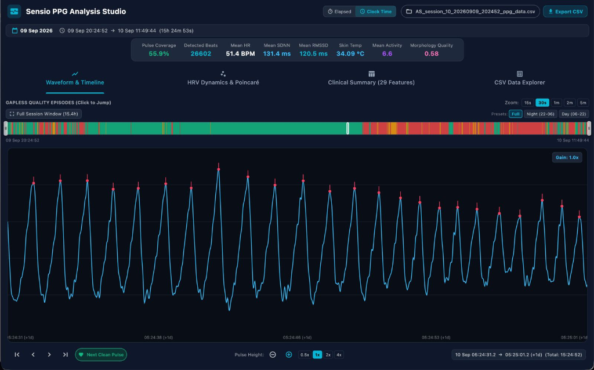
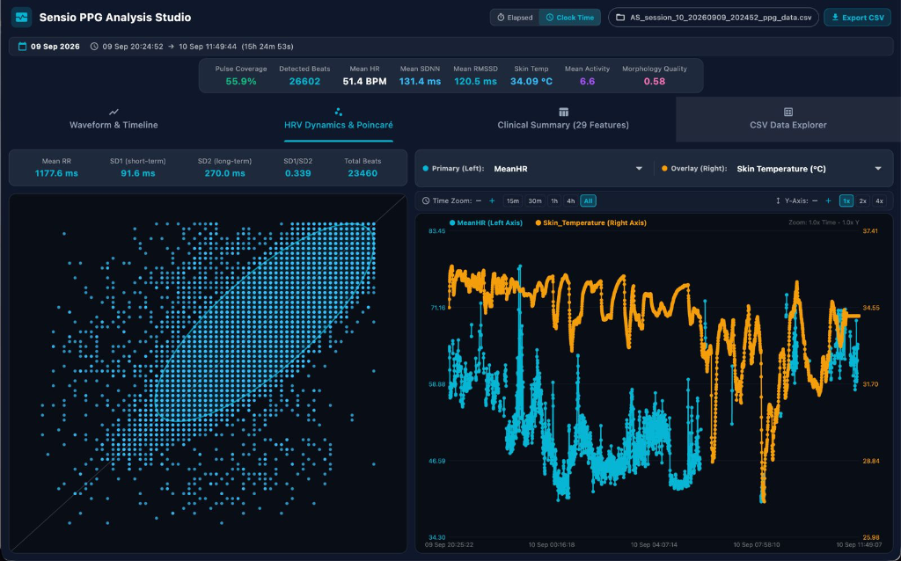
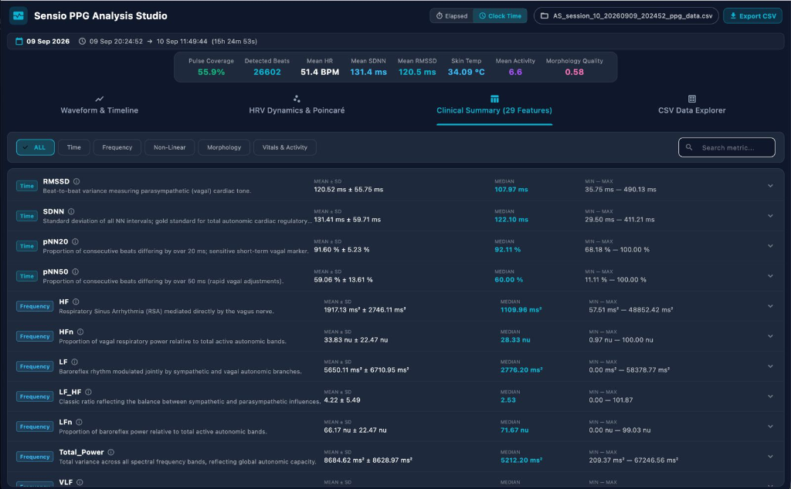

<p align="center">
  
</p>

<h1 align="center">CCS PPG Studio</h1>

<p align="center">
  <b>Clinical & Research Photoplethysmography (PPG) Analytics Platform</b>
</p>

<p align="center">
  A Joint Research & Engineering Collaboration of<br>
  <b>Centre for Consciousness Studies (CCS)</b>, Department of Neurophysiology,<br>
  <b>National Institute of Mental Health and Neurosciences (NIMHANS)</b>, Bengaluru, India<br>
  🤝<br>
  <a href="https://www.sensio-ai.in/"><b>SensIO</b></a> &nbsp;|&nbsp; <a href="https://www.neuro-stellar.com/"><b>Neurostellar</b></a>
</p>

<p align="center">
  <a href="https://github.com/arunsasidharan84/CCS_PPGStudio/releases/latest"></a>
  <a href="https://github.com/arunsasidharan84/CCS_PPGStudio/actions/workflows/build_and_deploy.yml"></a>
  <a href="https://github.com/arunsasidharan84/CCS_PPGStudio/releases"></a>
</p>

<p align="center">
  <b>Current version: 1.0.1</b> ·
  <a href="https://github.com/arunsasidharan84/CCS_PPGStudio/releases">Release notes</a> ·
  <a href="https://github.com/arunsasidharan84/CCS_PPGStudio/issues">Report a problem</a>
</p>

<p align="center">
  <a href="#-quick-download"><b>📥 Download App</b></a> &nbsp;•&nbsp;
  <a href="#about"><b>About</b></a> &nbsp;•&nbsp;
  <a href="#-executive-overview--key-capabilities"><b>Key Capabilities</b></a> &nbsp;•&nbsp;
  <a href="#-visual-walkthrough--module-breakdown"><b>Module Walkthrough</b></a> &nbsp;•&nbsp;
  <a href="#-getting-started--building-locally"><b>Build from Source</b></a> &nbsp;•&nbsp;
  <a href="https://github.com/arunsasidharan84/CCS_PPGStudio/issues"><b>Report Issue</b></a>
</p>

---

### 📥 Quick Download

Pre-built standalone desktop and mobile packages are published automatically through GitHub Releases:

| Platform | Package Type | Extracted App / Binary | Direct Download Link |
| :--- | :--- | :--- | :--- |
| **macOS** | Universal desktop application (.zip) | **`CCS PPG Studio.app`** | [CCSPPGStudio-macos.zip](https://github.com/arunsasidharan84/CCS_PPGStudio/releases/latest/download/CCSPPGStudio-macos.zip) |
| **Windows** | 64-bit desktop package (.zip) | `CCSPPGStudio.exe` | [CCSPPGStudio-Windows.zip](https://github.com/arunsasidharan84/CCS_PPGStudio/releases/latest/download/CCSPPGStudio-Windows.zip) |
| **Android** | Mobile & Tablet APK | `CCSPPGStudio-Android.apk` | [CCSPPGStudio-Android.apk](https://github.com/arunsasidharan84/CCS_PPGStudio/releases/latest/download/CCSPPGStudio-Android.apk) |
| **iOS** | iOS package (.ipa / .zip) | `CCSPPGStudio-iOS.zip` | [CCSPPGStudio-iOS.zip](https://github.com/arunsasidharan84/CCS_PPGStudio/releases/latest/download/CCSPPGStudio-iOS.zip) |

> 📦 **All Releases & Assets:** View all published binaries and platform assets on the **[GitHub Releases Page](https://github.com/arunsasidharan84/CCS_PPGStudio/releases/latest)**.

#### 🍏 First-Time Launch for macOS Users (Gatekeeper Setup)

When extracting `CCSPPGStudio-macos.zip`, macOS extracts **`CCS PPG Studio.app`** into your `~/Downloads` folder. Because development builds are ad-hoc signed, macOS Gatekeeper blocks opening them by default.

To enable the app, run the following in **Terminal**:

```sh
# 1. Clear Gatekeeper quarantine on the downloaded app:
xattr -rd com.apple.quarantine ~/Downloads/CCS\ PPG\ Studio.app

# 2. Move to Applications folder:
mv ~/Downloads/CCS\ PPG\ Studio.app /Applications/
```

> **Tip (Finder alternative):** In Finder, **Right-click (or Control-click)** `CCS PPG Studio.app` → select **Open** → click **Open** on the security confirmation prompt. You only need to do this once.

<p align="center">
  
</p>

---

## About

**CCS PPG Studio** is a high-performance, cross-platform signal visualization, quality-gated beat detection, and autonomic neurophysiology analysis suite. Built specifically for continuous photoplethysmography (PPG) acquired from wearable sensors (such as the **SensIO Smart Ring**, **Orbit Wearable**, and clinical pulse oximeters), CCS PPG Studio bridges raw sensor telemetry with publication-ready digital biomarkers, multi-domain Heart Rate Variability (HRV), pulse morphology analytics, and executive PDF reporting.

---

## 🌟 Executive Overview & Key Capabilities

CCS PPG Studio addresses the primary engineering and signal quality challenges inherent in ambulatory and wearable PPG: motion artifacts, sensor detachment, baseline wander, non-uniform Bluetooth packet arrival, and ectopic pulses.

* **Gapless Macro-Episode Quality Partitioning**: Every millisecond of the recording is labeled into mutually exclusive, contiguous states (`GOOD`, `REJECT`, `BAD`), guaranteeing complete coverage accounting without artificial interpolation across artifact gaps.
* **Dual-Stage Refractory SQI Peak Detection**: Combines physiological refractory gating ($250\text{ ms} \le RR \le 2000\text{ ms}$, $30–240\text{ BPM}$) with morphological template matching (skewness, kurtosis, and correlation).
* **Optional Quality-Aware IPFM & SQI-Weighted Kalman Filter**: An advanced cardiac processing pipeline ported and adapted from Orbit CCI, featuring spurious beat pruning ($< 60\%$ confidence), continuous chain segmentation ($\le 4$ missing beats), Integral Pulse Frequency Modulation (IPFM) autonomic decoupling, and Kalman filtering with dynamic measurement noise scaling ($R_k = R_0 / \text{SQI}_k$).
* **Clinical & Research 29-Feature Biomarker Dictionary**: Computes multi-domain physiological indicators across **Time Domain**, **Frequency Domain** (Welch FFT), **Non-Linear Dynamics** (Poincaré ellipse, Sample Entropy, Approximate Entropy), **Pulse Wave Morphology**, and **Circadian Vitals & Actigraphy**.
* **Publication-Grade Vector Poincaré Engine**: True $1\sigma$ orthogonal $SD1/SD2$ ellipse geometry with Gaussian density shading and strict gap-isolation (preventing artificial pairs from bridging rejected segments).
* **Two-Session Comparative Analysis & A/B Reporting**: Interactive dual-session overlay screen and side-by-side comparative PDF generation with quantitative percentage shifts ($\Delta \%$) for interventions, pre/post states, and algorithm benchmarking.
* **Responsive Multi-Form-Factor Architecture**: Seamlessly scales from compact mobile devices (390×844 phone viewports with searchable modal pickers) to expansive desktop and multi-monitor workstations (1280×800+).

---

## 📸 Visual Walkthrough & Module Breakdown

### 1. High-Resolution Waveform & Gapless Quality Timeline
The primary inspection workspace provides real-time visualization of raw vs. zero-phase filtered continuous PPG waveforms, annotated systolic peaks, and macro-episode classification.

<p align="center">
  
</p>

* **Top KPI Executive Banner**: Instant readout of session viability:
  * **Coverage %**: Percentage of valid, physiologically clean pulses (e.g., $55.9\%$).
  * **Beats**: Total detected clean cardiac cycles (e.g., $26,602\text{ beats}$).
  * **Mean HR**: Average pulse rate in beats per minute ($51.4\text{ BPM}$).
  * **SDNN & RMSSD**: Global and parasympathetic beat-to-beat variability ($131.4\text{ ms}$ and $120.5\text{ ms}$).
  * **Skin Temperature & Motion Activity**: Dual-channel circadian telemetry ($34.09\ ^\circ\text{C}$ and $6.6\text{ index}$).
  * **MQI (Mean Quality Index)**: Aggregate signal quality score ($0.58$).
* **Gapless Quality Ribbon**: The horizontal timeline displays every epoch categorized into:
  * 🟩 **GOOD**: High-fidelity pulse waveforms meeting physiological morphology and amplitude criteria.
  * 🟥 **REJECT**: Identified motion artifacts, sensor detachment, or excessive high-frequency noise.
  * ⬛ **BAD / GAP**: Flatlines, packet dropouts, or non-physiological refractory violations.
* **Continuous Waveform Viewer**: Zero-phase 0.4–8.0 Hz bandpass filtered PPG trace with red systolic peak markers positioned precisely at pulse crests.

---

### 2. Autonomic Dynamics & Vector Poincaré Geometry
The dynamics tab visualizes autonomic nervous system (ANS) balance via non-linear phase space reconstruction and synchronized time-series trend analysis.

<p align="center">
  
</p>

* **Clinical Poincaré Map ($RR_n \text{ vs } RR_{n+1}$)**:
  * Plots consecutive inter-beat intervals ($RR_n$ on horizontal axis vs. $RR_{n+1}$ on vertical axis).
  * **Orthogonal Eigenvector Axes**: Longitudinal identity line ($y = x$, representing overall variability) and perpendicular dispersion line ($y = -x + 2\overline{RR}$, representing beat-to-beat variability).
  * **$1\sigma$ Confidence Ellipse**: Statistically derived bounding ellipse parameterized by $SD1$ (semi-minor axis) and $SD2$ (semi-major axis).
  * **Gaussian Density Shading**: Color-coded kernel density contours highlight clustering patterns (comet, torpedo, or dispersed fan shapes).
  * **Zero Gap-Bridging Guarantee**: Pairs are constructed strictly from temporally consecutive beats. If an artifact or bad epoch intervenes, pairing safely halts, preventing spurious extreme points.
* **Dual-Axis Multi-Metric Trend Chart**:
  * Simultaneous longitudinal tracking of two user-selectable parameters over the entire recording.
  * Compare autonomic shifts against physiological context (e.g., **Mean HR** in red vs. **Skin Temperature** in blue, or **RMSSD** vs. **Motion Activity**).

---

### 3. Clinical & Research 29-Feature Summary Dictionary
A structured statistical catalog breaking down the recording into 29 standardized physiological metrics across 5 distinct domains.

<p align="center">
  
</p>

| Domain | Biomarkers Included | Physiological Significance |
| :--- | :--- | :--- |
| **Time Domain HRV** | Mean HR, Min HR, Max HR, HR Std, Mean RR, SDNN, RMSSD, pNN50, pNN20, CV-RR | Basal cardiac rhythm, sympathetic-parasympathetic balance, vagal tone (RMSSD), and overall heart rate variability. |
| **Frequency Domain HRV** | VLF Power, LF Power, HF Power, Total Power, LF/HF Ratio, LFnu, HFnu | Sympathetic modulation (LF: 0.04–0.15 Hz), parasympathetic respiratory sinus arrhythmia (HF: 0.15–0.40 Hz), and sympathovagal ratio. |
| **Non-Linear Dynamics** | Poincaré SD1, Poincaré SD2, SD1/SD2 Ratio, Approximate Entropy (ApEn), Sample Entropy (SampEn) | Short-term beat-to-beat variance ($SD1$), long-term regulatory variance ($SD2$), autonomic flexibility, and structural physiological complexity. |
| **Pulse Morphology** | Systolic Amplitude, Pulse Width, Crest Time, Reflection Index, Pulse Transit Time proxy | Arterial stiffness, peripheral vascular resistance, systemic compliance, and stroke volume dynamics. |
| **Vitals & Actigraphy** | Skin Temperature, Tri-Axial Motion Index, Signal Quality Index (MQI), Valid Coverage % | Circadian thermoregulation, physical activity tracking, sleep/wake immobility, and artifact burden. |

---

### 4. Time-Series Data Explorer & Raw Stream Viewer
A dedicated tabular inspection view providing pagination, sorting, and microsecond-level precision across all extracted cardiac intervals.

* **Full Inter-Beat Interval (IBI) Table**: Complete listing of timestamp, pulse interval ($RR\text{ ms}$), instantaneous heart rate ($60000 / RR$), and sample-level signal quality index ($\text{SQI}$).
* **Dynamic Search & Filtering**: Isolate specific segments, review anomalous interval transitions, and cross-reference detected beats against raw telemetry.
* **CSV / JSON Data Export**: Export cleaned IBI series directly for external modelling in Python, R, or MATLAB.

---

## ⚡ Speed & Architectural Highlights

CCS PPG Studio is architected for instant responsiveness on large multi-hour recordings:

1. **Native Rust DSP Engine (`sensio_ppg_core`)**: Compute-heavy operations (zero-phase forward-backward digital filtering, convolution kernels, template matching, matrix inversion, and FFT) run in compiled Rust through high-speed C FFI bindings.
2. **Deterministic Memory Footprint**: Ingests multi-gigabyte continuous sensor streams using ring-buffered sliding windows and contiguous memory arrays, running seamlessly on resource-constrained mobile hardware.
3. **Reactive UI State Isolation**: Flutter isolate workers decouple data decoding and DSP computations from the UI rendering thread, locking canvas animations and gesture scrubbing at 60+ FPS.

---

## 🔬 Deep-Dive: Signal Processing Logics

### A. Standard Refractory SQI vs. Quality-Aware IPFM & Kalman Filtering

CCS PPG Studio includes two state-of-the-art peak detection pipelines:

#### 1. Standard Refractory SQI
* **Gating**: Dynamic physiological refractory blanking ($250\text{ ms} \le RR \le 2000\text{ ms}$).
* **Morphology Template Matching**: Computes correlation with an empirical PPG pulse template to produce an epoch SQI between 0.0 and 1.0.
* **Best Suited For**: Clean to moderately noisy daytime records, clinical pulse oximetry, and fast visual verification.

#### 2. Quality-Aware IPFM & SQI-Weighted Kalman Filtering (Orbit Model)
Ported directly from research grade algorithms for wearable ring PPG:
* **Spurious Beat Pruning**: Rejects candidate beats with template confidence $< 60\%$.
* **Continuous Chain Segmentation**: Partitions the beat stream whenever $> 4$ consecutive beats are missing, preventing artificial interpolation across long dropouts.
* **IPFM Representation**: Models the instantaneous cardiac rhythm as the output of an Integral Pulse Frequency Modulation threshold crossing:
  $$m(t) = d_{RR}(t) - 1$$
* **Kalman Filtering with Adaptive Noise Scaling**:
  $$R_k = \frac{R_0}{\text{SQI}_k}$$
  Where noisy samples ($\text{SQI} \to 0$) inflate measurement variance $R_k$, gracefully shifting state estimates toward the physiological prior.

---

## 📑 Comprehensive PDF Reporting & Session Comparison

### 1. Single-Session Executive PDF Report
* Executive cover banner featuring subject ID, recording date, total duration, and overall coverage percentage.
* High-resolution vector Poincaré plot with $SD1/SD2$ orthogonal axes and $1\sigma$ ellipse contours.
* Complete 29-feature clinical biomarker table organized into standardized domains.
* Gapless macro-episode distribution breakdown with percentage pie chart.

### 2. Two-Session A/B Comparison Report
Enables head-to-head comparison between two recordings (e.g., Pre vs. Post intervention, Day 1 vs. Day 2, or Standard vs. IPFM+Kalman processing):
* **Side-by-Side Poincaré Scatter Maps**: Direct visual comparison of ellipse orientation, $SD1$ dispersion, and $SD2$ elongation.
* **Quantitative Shift Matrix ($\Delta$ & $\Delta \%$)**:
  $$\Delta \% = \left(\frac{\text{Session}_2 - \text{Session}_1}{\text{Session}_1}\right) \times 100$$
* Color-coded directional badges indicating significant autonomic increases or reductions.

---

## 📂 Universal Data Ingestion & File Formats

* **SensIO Smart Ring (`*_ppg_data.csv`)**:
  * Configurable file filter (definable in Settings).
  * Ingests synchronized infrared/green PPG, ambient temperature, tri-axial accelerometer ($X/Y/Z$), and battery telemetry.
* **Orbit Smart Wearable (`.orb` & `.signal`)**:
  * Native binary and JSON-lines decoder for Orbit recordings.
  * Specifically targets **Channel E (PPG)**.
  * Preserves hardware sample counter ticks ($T$) at 62.5 Hz to maintain microsecond-accurate timekeeping across Bluetooth packet boundaries.
* **Generic Clinical & Research CSVs**:
  * Header-adaptive column mapper supporting comma, tab, or semicolon delimiters.
  * Compatible with standard physiological recording systems (Empatica, BioRadio, Shimmer, Polar, and custom DAQ boards).

---

## 🚀 Getting Started & Building Locally

### Prerequisites
* [Flutter SDK](https://docs.flutter.dev/get-started/install): 3.22.x or higher (Stable channel)
* [Rust Toolchain](https://www.rust-lang.org/tools/install): `cargo` and `rustc` 1.75+
* C/C++ Compiler: Clang/Xcode on macOS, MSVC on Windows, GCC on Linux

### 1. Clone the Repository
```sh
git clone https://github.com/arunsasidharan84/CCS_PPGStudio.git
cd CCS_PPGStudio
```

### 2. Build the Native Rust Engine
```sh
cd rust
cargo build --release
cd ..
```

### 3. Install Flutter Dependencies & Run
```sh
flutter pub get

# Launch on macOS Desktop
flutter run -d macos

# Launch on Windows Desktop
flutter run -d windows

# Launch on Linux Desktop
flutter run -d linux

# Launch on Connected Android or iOS Device
flutter run -d <device-id>
```

### 4. Run Automated Test Suites
```sh
# Run Dart unit, integration, and UI tests
flutter test

# Run Rust native DSP and matrix tests
cd rust && cargo test && cd ..
```

---

## 🤝 Research Collaboration & Acknowledgments

**CCS PPG Studio** is developed as a joint research and engineering collaboration by:

* **Centre for Consciousness Studies (CCS)**  
  *Department of Neurophysiology*,  
  **National Institute of Mental Health and Neurosciences (NIMHANS)**, Bengaluru, India.  
  *Pioneering research into altered states of consciousness, sleep neurophysiology, meditation, and autonomic dynamics.*

* **SensIO** ([https://www.sensio-ai.in/](https://www.sensio-ai.in/))  
  *Innovators in next-generation smart ring hardware, continuous wearable biosensing, and edge health analytics.*

* **Neurostellar** ([https://www.neuro-stellar.com/](https://www.neuro-stellar.com/))  
  *Experts in advanced neurotechnology, non-invasive physiological monitoring, and clinical-grade health AI platforms.*

---

## 🔗 Related Repositories

| Repository | Description |
| :--- | :--- |
| [CCS Sleep Studio](https://github.com/arunsasidharan84/CCS_SleepStudio) | Sleep EEG visualization, manual staging, 9 automated AI models, and AnalyseNidra quantitative reports |
| [CCS Mobile Studio](https://github.com/arunsasidharan84/CCS_MobileStudio) | Mobile/desktop neurophysiology acquisition, stimulation, ANGEL ERP, and cognitive experiments |
| [CCS EEG Studio](https://github.com/arunsasidharan84/CCS_EEGStudio) | Native-speed EEG preprocessing, feature extraction, connectivity, statistics, and reporting |

---

## 📚 Key Scientific Literature

1. **Task Force of the European Society of Cardiology and the North American Society of Pacing and Electrophysiology** (1996). *Heart rate variability: standards of measurement, physiological interpretation, and clinical use.* Circulation, 93(5), 1043–1065.
2. **Brennan, M., Palaniswami, M., & Kamen, P.** (2001). *Do existing measures of Poincaré plot geometry reflect nonlinear features of heart rate variability?* IEEE Transactions on Biomedical Engineering, 48(11), 1342–1347.
3. **Elgendi, M.** (2012). *On the analysis of fingertip photoplethysmogram signals.* Current Cardiology Reviews, 8(1), 14–25.
4. **Mateo, J., & Laguna, P.** (2000). *Analysis of heart rate variability in the presence of ectopic beats using the heart timing signal.* IEEE Transactions on Biomedical Engineering, 47(7), 896–907.
5. **Orphanidou, C., et al.** (2015). *Signal-quality indices for the electrocardiogram and photoplethysmogram: deriving native indices.* IEEE Journal of Biomedical and Health Informatics, 19(3), 832–839.
